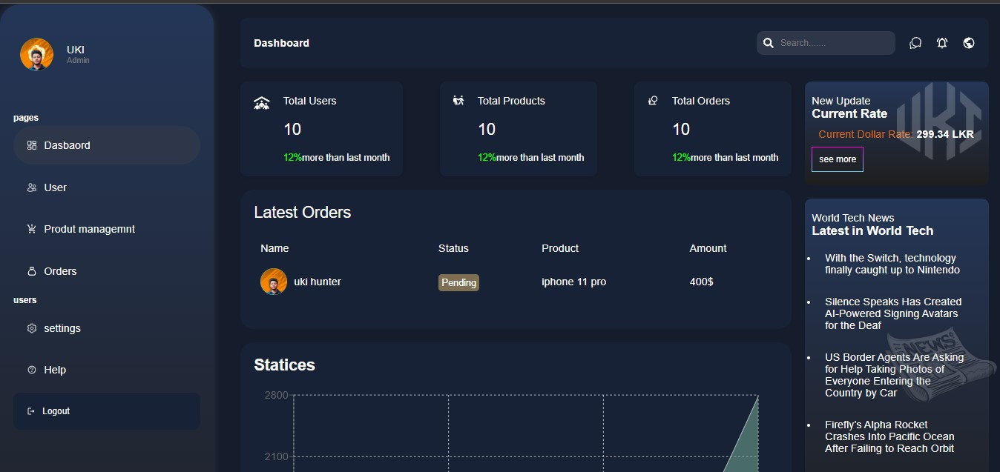

# icellers Dashboard



A modern dashboard web application built with [Next.js](https://nextjs.org/), featuring product and user management, analytics, and a responsive UI.

## Features

- **Dashboard**: Overview cards, latest orders, and charts ([app/dashboard/page.jsx](app/dashboard/page.jsx))
- **Product Management**: Add, view, and manage products ([app/dashboard/products/page.jsx](app/dashboard/products/page.jsx), [app/dashboard/products/add/page.jsx](app/dashboard/products/add/page.jsx))
- **User Management**: Add and manage users ([app/dashboard/users/add/page.jsx](app/dashboard/users/add/page.jsx))
- **UI Components**: Custom sidebar, navbar, cards, order tables, and footer ([app/ui/](app/ui/))
- **Authentication**: Login page ([app/login/](app/login/))
- **Responsive Design**: Built with CSS modules and React Icons

## Getting Started

1. **Install dependencies:**

   ```sh
   npm install
   ```

2. **Run the development server:**

   ```sh
   npm run dev
   ```

3. Open [http://localhost:3000](http://localhost:3000) to view the app.

## Project Structure

- `app/` - Main application pages and features
- `app/ui/` - Reusable UI components (sidebar, navbar, cards, etc.)
- `public/` - Static assets (images, icons)
- `pages/api/` - API routes (if any)
- `types/` - TypeScript types (if used)

## Customization

- Update branding and links in [`app/ui/footer/footer.jsx`](app/ui/footer/footer.jsx)
- Modify sidebar navigation in [`app/ui/dashboard/sidebar/sidebar.jsx`](app/ui/dashboard/sidebar/sidebar.jsx)
- Add or edit dashboard cards in [`app/ui/dashboard/card/`](app/ui/dashboard/card/)
